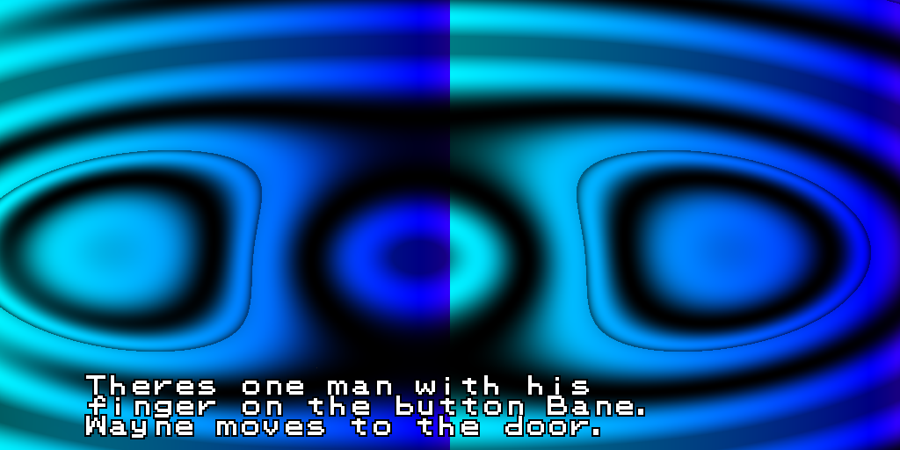
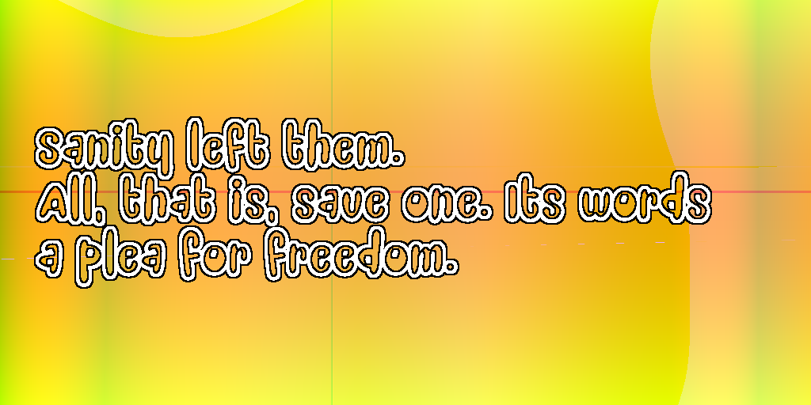
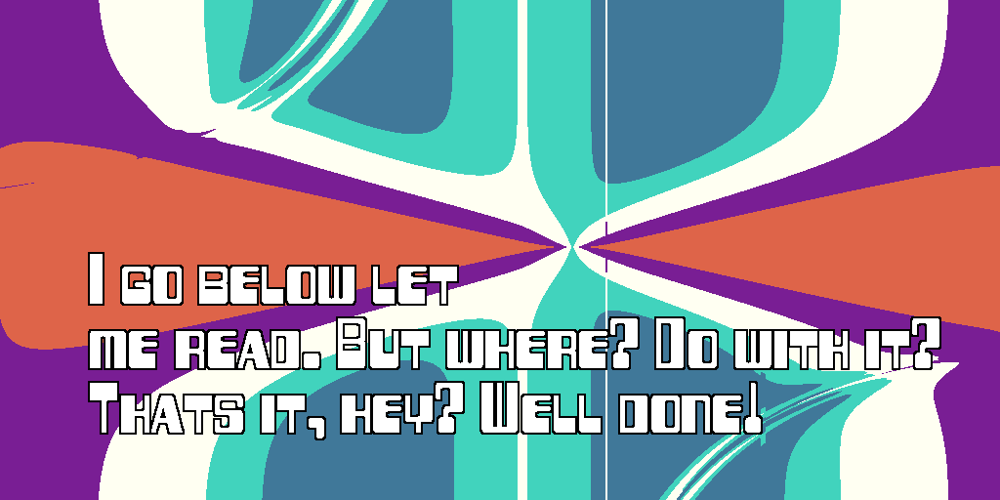
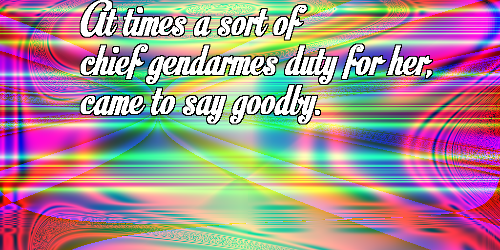

# Pyku

Pyku is a twitter bot that generates poems using markov chains and popular books or movies. Now, he also generates art to accompany his tweets.

### Prerequisites

For this project, you will need:

[tweepy](https://github.com/tweepy/tweepy) to interact with twitter.

[markovify](https://github.com/jsvine/markovify) to process your sources and generate poems.

[scipy](https://www.scipy.org/install.html) for some of the functions used.

## Setup

Just clone the repository and set up a credentials file, as per [tweepy's instructions](https://github.com/tweepy/tweepy).

## Examples

See the [bot live](https://twitter.com/PythonHaiku)!

Or make it tweet yourself from it's [website](https://pyku.gavyn.com).

Some example pictures:

1984

American Psycho

Batman: The Dark Knight Rises

The Bible

Blue Velvet

Brave New World

Dota 2 Lore

Dota 2 Reviews

Farewell to Arms

Fear and Loathing in Las Vegas

Fortune Cookies

The Great Gatsby

Illiad

Infinite Jest

Moby Dick

Shrek

The Room (Original Script)

Trump Tweets

War and Peace

## Authors

* **Gavyn Partlow** - *All Work* - [CtrlAltDeplete](https://github.com/CtrlAltDeplete)

* **Mickenzie Willars** - *Initial Idea for Art*

## License

This project is licensed under the MIT License - see the [LICENSE.md](LICENSE.md) file for details
